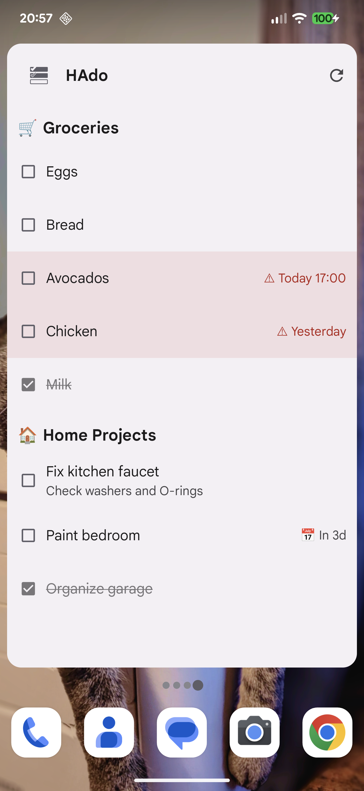
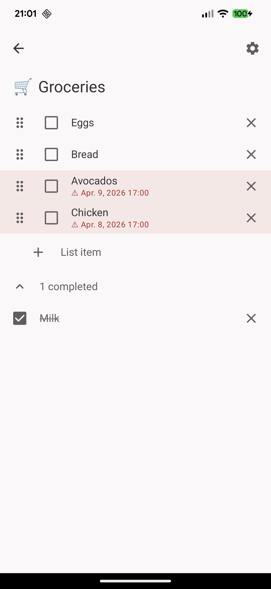
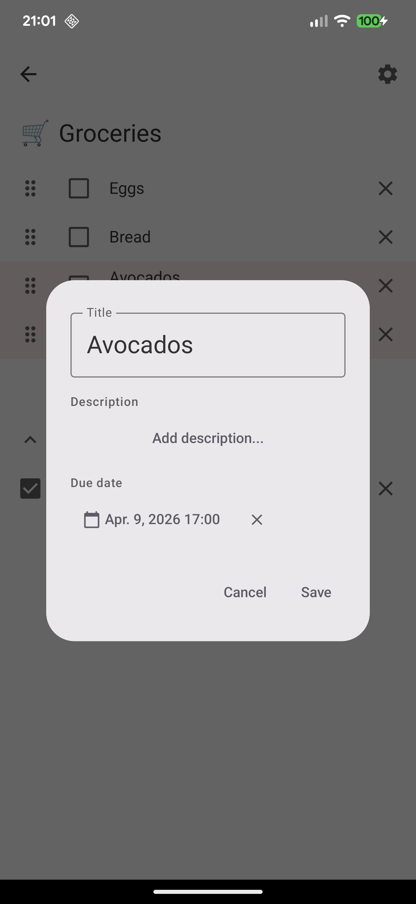

#  HAdo

Privacy-first Android home screen widget for your Home Assistant to-do lists.

<a href="https://play.google.com/store/apps/details?id=com.baer.hado">
  
</a>

## Screenshots

| Widget | List Editor | Item Detail |
|--------|-------------|-------------|
|  |  |  |

## Features

- **Home screen widget**: view and manage your to-do lists directly from your home screen
- **Multi-list support**: display multiple to-do lists in a single widget
- **Quick add**: add items from the widget or the full-screen editor
- **Drag to reorder**: reorder items with drag handles (requires local_todo or similar)
- **Due dates & times**: set due dates with overdue highlighting
- **Markdown descriptions**: add rich-text descriptions to your to-do items
- **Per-list icons**: customize each list with emoji, image, or HA entity icons
- **Customizable widget**: font size, opacity, compact mode, dark/light theme
- **Material You**: dynamic colors that follow your system theme
- **Local Mode**: use it as a standalone to-do widget without Home Assistant
- **Direct HA communication**: connects directly to your HA instance, no cloud required
- **OAuth2 authentication**: secure login via Home Assistant's OAuth flow
- **Zero tracking**: no analytics, no ads, no data collection

## Requirements

- Android 13 (API 33) or higher
- A running Home Assistant instance accessible from your device

## Installation

### From Releases

Download the latest APK from [Releases](https://github.com/IT-BAER/hado/releases).

### Build from Source

```bash
git clone https://github.com/IT-BAER/hado.git
cd hado
./gradlew assembleDebug
```

The APK will be in `app/build/outputs/apk/debug/`.

## Tech Stack

| Component | Library |
|-----------|---------|
| UI | Jetpack Compose + Material 3 |
| Widget | Glance 1.1.0 |
| Networking | OkHttp + Retrofit |
| DI | Hilt |
| Background Sync | WorkManager |
| Markdown | Markwon |
| Security | EncryptedSharedPreferences |

## Privacy

HAdo does not collect, transmit, or share any data with third parties. All communication happens directly between your device and your Home Assistant instance over HTTPS.

See [PRIVACY.md](PRIVACY.md) for the full privacy policy.

## License

Apache License 2.0. See [LICENSE](LICENSE) for details.

## Contributing

Issues and feature requests are welcome. Please open an issue before submitting pull requests.

## 💜 Support

If you like HAdo, consider supporting this and future work, which heavily relies on coffee:

[Buy Me A Coffee](https://www.buymeacoffee.com/itbaer) | [Donate via PayPal](https://www.paypal.com/donate/?hosted_button_id=5XXRC7THMTRRS)
